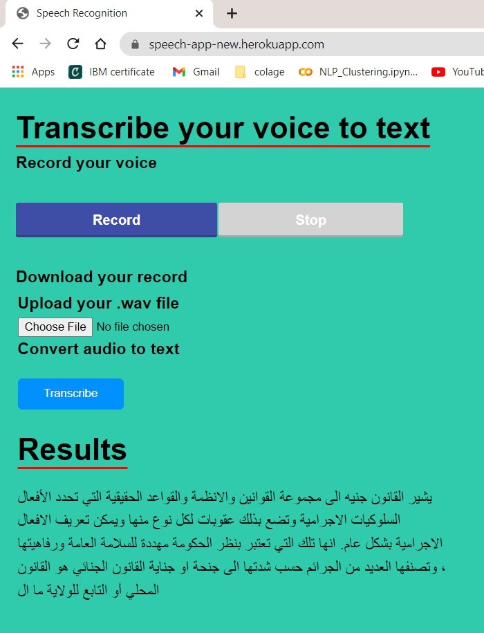

# Record your voice to text using Flask 

 
<h1 align="center">Hi 👋, speech to text interface the results can e edited and downloaded as text or word file </h1>

In this blog post, we are going to create a simple web app that allows us record our voice from the web browser and convert it to text by using the we browser

First we get the main programs

```
git clone https://github.com/sameh999/Speech-to-text-Arabic.git
```

we enter to the folder

```
cd Voice-to-text-with-Python-in-Flask
```

Create Python Virtual Environment

```
python -m venv transcribe
source transcribe/bin/activate
```

Install Flask and  Gunicorn

```
pip install flask gunicorn
```


We can see that the app.py file contains the information relevant to convert audio to text

**app.py**

```python
from flask import Flask, render_template, request, redirect
import speech_recognition as sr

app = Flask(__name__)


@app.route("/", methods=["GET", "POST"])
def index():
    transcript = ""
    if request.method == "POST":
        print("FORM DATA RECEIVED")

        if "file" not in request.files:
            return redirect(request.url)

        file = request.files["file"]
        if file.filename == "":
            return redirect(request.url)

        if file:
            recognizer = sr.Recognizer()
            audioFile = sr.AudioFile(file)
            with audioFile as source:
                data = recognizer.record(source)
            transcript = recognizer.recognize_google(data, key=None)

    return render_template('index.html', transcript=transcript)


if __name__ == "__main__":
    app.run(debug=True, threaded=True)
```

The entry point to the application, wsgi.py


**wsgi.py**

```
from app import app
if __name__ == "__main__":
  app.run()
```

We can  run the application in your local system

and verify that it works locally

This has the following requirements.txt 


```
Flask==2.0.1
SpeechRecognition==3.8.1
pytest==6.2.4
gunicorn==20.1.0
```

in such case you require to modify the dependencies you can perform

```
pip freeze
pip freeze > requirements.txt
```

the Procfile file

**Procfile**

```
web: gunicorn wsgi:app
```

we requiere a  **runtime.txt** file

we can check the supported [runtimes](https://devcenter.heroku.com/articles/python-support#supported-runtimes) in my case I will use  the version python-3.7.11

```
python-3.7.11
```

In this step you’ll install the Heroku Command Line Interface (CLI). You use the CLI to manage and scale your applications, provision add-ons, view your application logs, and run your application locally.

To record the audio I have used a simple HTML/JS demo that uses [WebAudioRecorder.js](https://github.com/higuma/web-audio-recorder-js) to record wav  a web page.


#### Install the Heroku CLI

Download and install the [Heroku CLI](https://devcenter.heroku.com/articles/heroku-command-line).

If you haven’t already, log in to your Heroku account and follow the prompts to create a new SSH public key.

```
$ heroku login
```


## Deploy the app

In this step you will deploy the app to Heroku.

Create an app on Heroku, which prepares Heroku to receive your source code:

```term
heroku create voicetotext-ruslanmv
```

if we type only `heroku create` it is automatically generated instance name plus the Heroku domain.

When you create an app, a git remote (called `heroku`) is also created and associated with your local git repository.

Heroku generates a random name (in this case `speech-app-new`) for your app, or you can pass a parameter to specify your own app name.

If you haven’t already added these files to a git repo, do it by running the following in your terminal:

```
git init
git add -A
git commit -am "commit message here"
heroku git:remote -a  voicetotext-ruslanmv
git push heroku master
```

We just need to push this to a Heroku dyno. First, let’s allocate a Heroku dyno for our app by running:

```
heroku open
```

You’ll notice the web address is 

[https://speech-app-new.herokuapp.com/](https://speech-app-new.herokuapp.com/)

If you enter, you should wait at least one minute to initialize the application.

The current version of the application  work with **4 steps**

**Step 1**: Record your voice with your microphone

You should allow use your microphone. and when you finish to record press **stop**

**Step2** . Download your file to your desktop

Step 3. Upload your wave file and then

Step 4 press transcribe button and you see the results

You can try:

[https://speech-app-new.herokuapp.com/](https://speech-app-new.herokuapp.com/)


**Congratulation!** You were able to create a web app that can convert your audio to text

